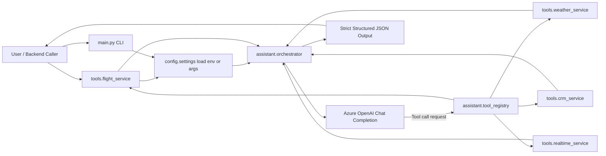

# Architecture

This project uses Azure OpenAI function-calling as the orchestration layer between user intent and business tools.

## Mermaid diagram

## Flow summary

1. Request enters via `main.py`.
    - or via FastAPI `POST /assist`.
2. Settings are loaded from args or environment.
3. Orchestrator sends prompt + tool definitions to Azure OpenAI.
4. Model selects tool(s).
5. Python executes selected tool(s).
6. Results are fed back to model context.
7. Final response is emitted as strict JSON for backend systems.
