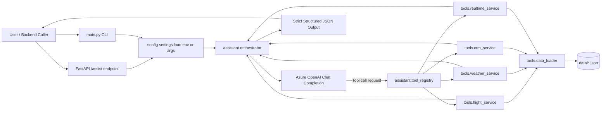

# Architecture

This project uses Azure OpenAI function-calling as the orchestration layer between user intent and business tools.

## Mermaid diagram

## Flow summary

1. Request enters via `main.py` (CLI) or FastAPI `POST /assist`.
2. Settings are loaded from args or `.env` environment variables.
3. Orchestrator sends prompt + tool definitions to Azure OpenAI.
4. Model selects tool(s) and returns structured tool-call requests.
5. `tool_registry` dispatches to the appropriate service in `tools/`.
6. Each service uses `data_loader` to read from `data/*.json`.
7. Tool results are fed back to the model context.
8. Final response is emitted as strict JSON for backend systems.

## Deployment

- **Docker image** built from `Dockerfile` (Python 3.12-slim)
- **CI** (`.github/workflows/ci.yml`): validates, builds, and pushes image to Azure Container Registry
- **CD** (`.github/workflows/cd-aca.yml`): deploys to Azure Container Apps
- ACR auth uses OIDC — no registry username/password needed
